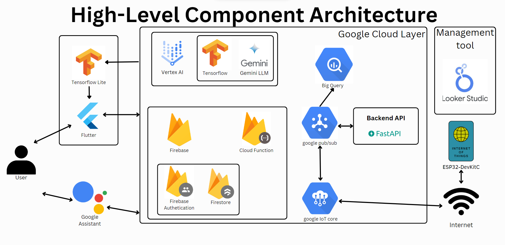

# GreenPeak

GreenPeak is a comprehensive Home Energy Management System (HEMS) implemented as a Flutter mobile application. This project integrates powerful AI and IoT technologies to provide users with automated energy monitoring, community impact, cost savings, safety, and more.

## Link to the GreenPeak Demo Video
[GreenPeak Demo](https://www.youtube.com/watch?v=ZIhjW6q7F4s)

## Link to Figma Prototype
[GreenPeak Figma Prototype](https://www.figma.com/proto/EvBmKmPes239ieI2GLW7Z1/Kitahack?type=design&node-id=251-706&t=CGnHL29nwBvEZxwp-1&scaling=scale-down&page-id=26%3A810&starting-point-node-id=251%3A706)

## Table of Contents
- [Introduction](#introduction)
- [Key Features](#key-features)
- [Technology Architecture](#technology-architecture)
- [Nature of this Project](#nature-of-this-project)

## Introduction

GreenPeak addresses the challenges of high energy costs, environmental impact, and convenience & safety through a user-friendly mobile app. It encourages energy-efficient practices, community energy sharing, and provides predictive insights to optimize energy usage.

## Key Features

**1. Energy Insight:**
   - Visualizes and manages energy usage for cost-effective consumption.

**2. Optimized Energy Usage:**
   - Utilizes dynamic pricing, analytics, and AI-driven optimization for informed energy decisions.

**3. Cost-Efficient Billing:**
   - Maximizes extra energy for potential bill cost reductions.

**4. Community Energy Sharing:**
   - Promotes local energy sharing, contributing to reduced overall consumption.

**5. Energy Knowledge Forum:**
   - Fosters knowledge exchange on efficient and green energy practices.

**6. Safety Alert & Monitoring:**
   - Detects appliance abnormalities and intelligently manage IoT energy flow, also issues emergency notifications.

**7. Integrated IoT Device Control:**
   - Streamlines household tasks by centralizing IoT device management.

**8. AI-Driven Energy Optimization:**
   - Smartly optimizes energy usage based on factors such as weather forecasts and other relevant parameters.

## Technology Architecture

GreenPeak employs a sophisticated technology stack, seamlessly integrating various components to deliver a powerful Home Energy Management System (HEMS) with an emphasis on user interaction, AI-driven insights, and IoT device control.

### Mobile App (Flutter)

The mobile app serves as the primary interface for users to interact with the system and IoT components. Developed using Flutter, it ensures a consistent and user-friendly experience across both Android and iOS devices.

### Google Cloud Platform

Google Cloud Platform (GCP) acts as the backbone, providing access to a suite of Google technologies and services. It hosts the database, manages the backend server, and enables seamless integration with other Google services.

### Firebase

Firebase facilitates the integration of the application with Google Cloud. It handles user authentication, stores user interaction data using Firestore, and ensures secure access to the broader Google Cloud ecosystem.

### Vertex AI

Vertex AI serves as the access point for the system, facilitating interactions with the Gemini LLM (Language Model) and TensorFlow. It is instrumental in the training and building of generative and predictive models critical for conversational interactions with users.

### Management Layer

The Management Layer plays a pivotal role in analyzing user and IoT device data. It evaluates app success, identifies areas for improvement, and informs future enhancements. This layer contributes to the continuous refinement and optimization of the overall system.

### IoT Appliances

IoT appliances consist of physical IoT Printed Circuit Boards (PCBs) that connect to the system via the internet. These devices form the tangible link between the digital system and the real-world IoT components.

### TensorFlow

TensorFlow is a key component responsible for training and hosting models. It provides predictions for time-series energy prices, energy usage forecasts with various factors, IoT energy control for automatic savings, and detection of energy abnormalities.

### TensorFlow Lite

TensorFlow Lite is utilized for graph selection and customization. It generates summarized information for display on the mobile application, enhancing the user interface with intelligently chosen charts, widgets, and texts.

### Gemini LLM (Language Model)

Gemini LLM is a generative AI model that serves as a chatbot within the application. It communicates with users, allowing direct assistant-like control for IoT devices. This model enhances user interactions, making them more intuitive and conversational.

### Backend API

The Backend API plays a crucial role in orchestrating communication between various system components. It connects the mobile app with Google Pub/Sub for efficient handling of IoT data and commands.

### Google Pub/Sub

Google Pub/Sub is employed for efficient communication within the system. It acts as a messaging service, facilitating real-time communication between components, particularly between the mobile app and Google IoT Core.

### Google IoT Core

Google IoT Core enables seamless integration with real-world IoT devices, specifically those utilizing ESP32 and connected via WiFi. This integration allows GreenPeak to control and monitor IoT devices efficiently, ensuring real-time responsiveness.

### Google BigQuery

Google BigQuery functions as a data warehouse, storing and processing information garnered from IoT devices through Pub/Sub. It plays a vital role in aggregating and analyzing large volumes of data, providing valuable insights for predictive analytics.

This orchestrated technology architecture aims to create a seamless and intelligent HEMS, ensuring optimal user experiences, efficient IoT device management, and continuous improvement through data-driven insights.

## Nature of this Project
This is a project submission repository for the KitaHack 2024 Hackathon. This project is not intended for commercial use. Our team members consist of students from the Asia Pacific University of Technology & Innovation (APU), Teh Chen Ming, (Desmond)Foo Yau Yit, Chooi Yao Feng, and Ooi Xin Ru